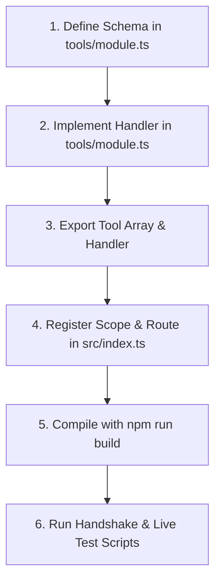

# 🤖 AI Coding Agent Developer Guide (AGENTS.md)

This document is the authoritative developer guide and instruction manual for any AI Coding Agent (such as Cursor, Windsurf, or custom agentic workflows) tasked with modifying, extending, or maintaining this **Gemini Enterprise MCP Server**. 

Before making any modifications to this codebase, you must read, understand, and strictly adhere to the guidelines, architectural safeguards, and development workflows outlined below.

---

## 📋 Table of Contents
1. [Codebase Architecture & File Structure](#1-codebase-architecture--file-structure)
2. [Dynamic Scoping & Gatekeeping (Least Privilege)](#2-dynamic-scoping--gatekeeping-least-privilege)
3. [GCP REST & Client API Safeguards (CRITICAL)](#3-gcp-rest--client-api-safeguards-critical)
3.5. [Native Agent Architecture: A2A vs Low-Code (Employee-Made)](#35-native-agent-architecture-a2a-vs-low-code-employee-made)
3.7. [Vertex AI Agent Platform Skills](#37-vertex-ai-agent-platform-skills)
4. [Step-by-Step Blueprint to Add a New Tool](#4-step-by-step-blueprint-to-add-a-new-tool)
5. [Operational Protocol for Surgical Code Editing](#5-operational-protocol-for-surgical-code-editing)
6. [Testing & Verification Protocol](#6-testing--verification-protocol)

---

## 1. Codebase Architecture & File Structure

This project is a Model Context Protocol (MCP) server written in **TypeScript (ESM)**. 

```text
ge-app-mcp/
├── package.json           # Project manifests and build scripts
├── tsconfig.json          # TypeScript compiler configuration (Target: ES2022 / Module: NodeNext)
├── src/
│   ├── index.ts           # MCP Server entrypoint (initializes transport, registers and routes tools)
│   ├── config.ts          # Environment variables and dynamic scope parser
│   └── tools/             # Segmented tool implementation modules
│       ├── search.ts      # Search and Conversational RAG tools (Data Plane)
│       ├── admin.ts       # Datastore, schema, web crawler, and control tools (Control Plane)
│       └── billing.ts     # Licensing pools and user seat allocation tools (Billing/Licensing Plane)
└── skills/                # Prompt templates conditioning AI Agents using this server
```

### Active Tool Registry

| Tool Name | Class / File | Description | GCP API Endpoint / SDK |
| :--- | :--- | :--- | :--- |
| `gemini_enterprise_search` | `tools/search.ts` | Retrieve semantic search results. | `SearchServiceClient` (Discovery Engine) |
| `gemini_enterprise_ask` | `tools/search.ts` | Execute Conversational Search RAG. | `ConversationalSearchServiceClient` |
| `gemini_enterprise_get_document`| `tools/search.ts` | Retrieve full document content & metadata. | `DocumentServiceClient` |
| `gemini_enterprise_manage_apps` | `tools/admin.ts` | Manage application configurations (CRUD & IAM). | `EngineServiceClient` / REST |
| `gemini_enterprise_manage_datastore`| `tools/admin.ts` | Instantiate or delete datastores. | `DataStoreServiceClient` |
| `gemini_enterprise_manage_documents`| `tools/admin.ts` | Async document import or purge. | `DocumentServiceClient` |
| `gemini_enterprise_manage_schema`| `tools/admin.ts` | Create or update datastore JSON schemas.| `SchemaServiceClient` |
| `gemini_enterprise_manage_controls`| `tools/admin.ts` | Sync synonym, boost, and filter controls. | `ControlServiceClient` |
| `gemini_enterprise_manage_agents`  | `tools/admin.ts` | Create, list, delete, and update native Discovery Engine Agents. | `AgentService` REST API (`v1alpha`) |
| `gemini_enterprise_manage_skills`  | `tools/admin.ts` | Manage Vertex AI platform Skills inside the Skill Registry. | REST API (`v1beta1`) |
| `gemini_enterprise_manage_target_sites`| `tools/admin.ts` | Administer crawled website URI patterns.| `SiteSearchEngineServiceClient` / REST |
| `gemini_enterprise_configure_connector`| `tools/admin.ts` | SaaS connectors simulation flow. | Simulated Connector Lifecycle |
| `gemini_enterprise_manage_licenses`| `tools/billing.ts`| Live seat assignments & licensing pools. | Global REST `licenseConfigs` & `userLicenses` |

---

## 2. Dynamic Scoping & Gatekeeping (Least Privilege)

To ensure **Least Privilege**, the server implements environment-driven dynamic scoping via `config.scopes` (configured via `MCP_SCOPES`).

### How Scopes Filter Tools
1.  **Scope Configuration**: Allowed scopes are defined as a comma-separated list in `process.env.MCP_SCOPES` (e.g. `search,billing`). If not provided, it defaults to `search,admin,billing`.
2.  **Dynamic Registration (`src/index.ts`)**:
    ```typescript
    const allTools: any[] = [];
    if (config.scopes.includes('search')) allTools.push(...searchTools);
    if (config.scopes.includes('admin')) allTools.push(...adminTools);
    if (config.scopes.includes('billing')) allTools.push(...billingTools);
    ```
3.  **Strict Gatekeeper Verification (`src/index.ts`)**:
    During `CallToolRequestSchema` processing, the server checks if the incoming tool name exists in `allTools`. If it does not, the request is rejected with a clear "Access Denied" error before any logic executes.

> [!WARNING]
> **AI Coding Rule**: Never bypass this check or hardcode tools outside their designated scopes. When adding or modifying tools, ensure they are strictly mapped to their appropriate scope blocks in `src/index.ts`.

---

## 3. GCP REST & Client API Safeguards (CRITICAL)

When writing or modifying API integration logic (especially when using raw REST fetches or low-level HTTP clients), you **must** strictly enforce the following architectural safeguards to avoid runtime failures.

### 🔑 A. Robust Google Authentication Headers Handling
In Node.js 18+, `GoogleAuth.getRequestHeaders()` can return a native iterable `Headers` object instead of a plain JavaScript object. Running `Object.entries(headers)` on an iterable `Headers` object returns an empty array `[]`, causing silent authentication failures (`401 Unauthorized`).

You **must** always use a polymorphic header copier that handles both iterables and plain objects:

```typescript
async function getAuthHeaders(projectId: string): Promise<Record<string, string>> {
  const auth = new GoogleAuth({
    scopes: ['https://www.googleapis.com/auth/cloud-platform']
  });
  const headers = await auth.getRequestHeaders();
  const authHeaders: Record<string, string> = {};
  
  if (headers && typeof headers.forEach === 'function') {
    // Node.js 18+ iterable Headers object
    headers.forEach((value, key) => {
      if (value) {
        authHeaders[key.toLowerCase()] = value;
      }
    });
  } else if (headers) {
    // Plain Javascript Object
    for (const [key, value] of Object.entries(headers)) {
      if (value) {
        authHeaders[key.toLowerCase()] = value as string;
      }
    }
  }
  
  // Normalization and Quota Routing
  authHeaders['x-goog-user-project'] = projectId;
  authHeaders['content-type'] = 'application/json';
  return authHeaders;
}
```

### 🏷️ B. Strict Header Key Normalization (Lowercase)
Always normalize HTTP header keys to lowercase before setting, merging, or modifying them. 
If mixed-case headers (e.g. `X-Goog-User-Project` and `x-goog-user-project`) are sent, Node's HTTP clients may duplicate them or merge them as a comma-separated string (e.g., `project-id, project-id`). This results in a strict **HTTP 400 Bad Request** rejection from Google's Cloud endpoint gateways.

### 💼 C. Quota User Routing (`x-goog-user-project`)
To prevent `PERMISSION_DENIED` errors related to disabled sandbox projects or unconfigured default accounts, you must always append the `'x-goog-user-project': projectId` header. This explicitly attributes API call costs and quotas to the target user project.

---

## 3.5. Native Agent Architecture: A2A vs Low-Code (Employee-Made)

When creating or modifying agents under an Engine/App (`/assistants/default_assistant/agents/*`), the Discovery Engine REST API represents agents via three distinct definitions. You must match the correct definition based on the user's intent:

### 👤 A. Custom Agent-to-Agent (A2A) Agents (`a2aAgentDefinition`)
- **Use Case**: Connecting an external, self-hosted agent framework (e.g. hosted on Cloud Run/App Engine) to the Gemini Enterprise orchestration pipeline.
- **UI Category**: Renders under **"Your agents"**.
- **Properties**: Requires a strict `jsonAgentCard` string containing standard properties such as `protocolVersion: "a2a.v1"`, `name`, `description`, `url`, `version`, `capabilities` (`streaming: true`), `defaultInputModes` (`["text/plain"]`), `defaultOutputModes` (`["text/plain"]`), and `skills: []`.

### 🛠️ B. Native Low-Code / Employee-Made Agents (`lowCodeAgentDefinition`)
- **Use Case**: Highly customizable natural language playbook-based agents created inside the **Agent Designer** visual interface. Runs entirely native on GCP.
- **UI Category**: Renders under **"Your agents"** with type **"Employee-made"**.
- **Properties**: Configured with a natural language playbook `instruction` (natural language prompt), LLM `model` (e.g., `"gemini-3.5-flash"`), linked native tools (`selectedTools` like `googleSearch`), and linked enterprise datastores (`dataStoreSpecs` like Google Drive or website crawlers).

#### 🌐 B.1. Multi-Agent Playbook Topology (Sub-Agents)
A native low-code agent can be composed of multiple sub-agents coordinated by a main root agent. In the REST API, this is modeled as a list of independent cognitive nodes within the `nodes` and `deployedNodes` arrays:

1.  **Root Agent (Coordinating Node)**:
    - Renders as the entrypoint with `"id": "root_agent"` (referenced by `lowCodeAgentDefinition.rootAgentId`).
    - Its `llmAgentNode` includes an array of strings in `subAgentIds` (e.g., `["gecx_expert"]`) representing the IDs of the sub-agents it can delegate and route user requests to.
2.  **Sub-Agents (Worker Nodes)**:
    - Each sub-agent is a separate node object in the same `nodes` array (e.g., `"id": "gecx_expert"`, `"displayName": "GECX Expert"`).
    - Each worker node has its own distinct `llmAgentNode` containing localized natural language playbooks (`instruction`), descriptions, dedicated LLM `model` choices, enabling tools, and individual enterprise `dataStoreSpecs`.

When any AI Coding Agent lists or inspects agents using `gemini_enterprise_manage_agents`, it **must** inspect the full `lowCodeAgentDefinition` hierarchy (including all elements of the `nodes` array and corresponding routing keys like `subAgentIds`) to understand the complete modular multi-agent structure of the assistant.

### 🔒 C. Pre-Built Managed Agents (`managedAgentDefinition`)
- **Use Case**: Pre-packaged, Google-owned and managed read-only template agents (e.g. `deep_research` or `default_idea_generation`).
- **UI Category**: Renders under **"Google-made"**.
- **WARNING**: Do **NOT** use `managedAgentDefinition` when tasked with creating or managing custom, user-customizable agents, as they are locked templates.

---

## 3.7. Vertex AI Agent Platform Skills

In addition to playbooks and agents, the Vertex AI ecosystem includes a dedicated **Skill Registry** at the region/location level. These are independent resources that users can create via the platform UI under the "Skills" tab or manage programmatically via standard REST endpoints under `aiplatform.googleapis.com`.

### 🧩 A. Platform Skills Resource Path
Skills exist independently of individual agents or default assistants and follow a standard hierarchical naming convention:
```text
projects/{projectId}/locations/{location}/skills/{skillId}
```

### 🏷️ B. Creating & Managing Skills via REST API (`v1beta1`)
When creating or modifying platform skills, you must adhere to the following REST payload configurations:

1.  **Zipped Filesystem Requirement**: The `zippedFilesystem` field is **strictly required** for creation and cannot be empty. It must consist of a base64-encoded ZIP archive containing standard skill descriptors (such as `SKILL.md` or related tools/resources).
2.  **Long-Running Operations**: Creating, patching, or deleting a skill resource initiates a Long-Running Operation (`projects/{projectId}/locations/{location}/skills/{skillId}/operations/{operationId}`). Deleting a skill while its creation/update operation is still active will result in an HTTP 400 Bad Request.
3.  **Endpoint Redirection**: Unlike standard Discovery Engine tools which default to global collections, Platform Skills are regionalized resources and must be accessed via regionalized hostnames (e.g., `https://us-central1-aiplatform.googleapis.com`).

---

## 4. Step-by-Step Blueprint to Add a New Tool

When tasked with adding a new tool to this MCP server, strictly follow this execution path:



1.  **Define the Schema**: Create the tool definition block containing `name`, `description`, and `inputSchema` compliant with the Model Context Protocol SDK.
2.  **Implement the Handler**: Write the execution block. Wrap external API calls in a `try/catch` block, log actions using `console.error` (to prevent polluting the stdio transport), and return result payloads in the MCP standard format:
    ```typescript
    return {
      content: [{ type: 'text', text: JSON.stringify(resultData, null, 2) }]
    };
    ```
3.  **Register the Scope**: Add the tool definition to the correct array (`searchTools`, `adminTools`, or `billingTools`) and export the handler function.
4.  **Route the Request**: In `src/index.ts`, update `allTools` dynamic mapping and the `CallToolRequestSchema` switch/if router.
5.  **Compile and Verify**: Run `npm run build` and ensure TypeScript reports zero compilation or typings errors.

---

## 5. Operational Protocol for Surgical Code Editing

As an AI Coding Agent, you must practice **Surgical Code Modifications** to preserve codebase quality and avoid introducing unexpected regressions:

*   **Surgical Precision**: Touch only the exact lines of code required to implement the request. Do not format, reorganize, or "clean up" adjacent code unless explicitly asked to.
*   **English-Only Rule**: All comments, docstrings, schema descriptions, and console logs must be written strictly in **English**. 
*   **Preserve Comments**: Do not delete existing code documentation or architectural warnings.
*   **No Placeholders**: Never write mock or placeholder implementations. If a function is implemented, connect it directly to the real GCP REST/gRPC client SDK or throw a structured error.

---

## 6. Testing & Verification Protocol

The repository includes a suite of specialized test files to validate changes. **You must run these scripts to verify any modifications before concluding your task.**

### 🧪 The Test Suite

1.  **Handshake Validation (`test_mcp_client.mjs`)**:
    Launches the compiled server via stdio, executes an MCP `tools/list` handshake, and displays all registered tools.
    ```bash
    node tests/test_mcp_client.mjs
    ```
2.  **Read-Only Integration (`test_suite_readonly.mjs`)**:
    Validates GCP credentials and read operations (scans datastores, schemas, target sites, and executes queries).
    ```bash
    node tests/test_suite_readonly.mjs
    ```
3.  **Safe Write Lifecycle (`test_admin_write.mjs`)**:
    Performs synonym control creation, lists configurations to verify existence, and immediately deletes the control. No residues are left in the GCP project.
    ```bash
    node tests/test_admin_write.mjs
    ```
4.  **Native Agent Lifecycle (`test_agents_write.mjs`)**:
    Executes native Discovery Engine Agent creation, listing, update, and deletion lifecycle. Leaves zero leftover resource residues in the GCP project.
    ```bash
    node tests/test_agents_write.mjs
    ```
5.  **Low-Code Agent Lifecycle (`test_low_code_agents.mjs`)**:
    Validates native, employee-made low-code agent creation, listing, and deletion. Leaves zero residue in GCP.
    ```bash
    node tests/test_low_code_agents.mjs
    ```
6.  **App IAM Policy Lifecycle (`test_iam.mjs`)**:
    Validates App/Engine IAM policy reading, parsing, and writing roundtrip. Leaves zero residues in GCP.
    ```bash
    node tests/test_iam.mjs
    ```
7.  **Security Scope Enforcement (`test_mcp_scopes.mjs`)**:
    Spawns multiple handshakes with varied `MCP_SCOPES` variables (e.g. `search` only, `search,billing`, full scope) and verifies that unauthorized tool calls are securely blocked at the gatekeeper level.
    ```bash
    node tests/test_mcp_scopes.mjs
    ```

### 📋 AI Verification Checklist
- [ ] TypeScript compilation succeeds with zero errors: `npm run build`.
- [ ] Handshake test succeeds: `node tests/test_mcp_client.mjs` displays correct schemas.
- [ ] Security scope suite executes cleanly: `node tests/test_mcp_scopes.mjs` reports `PASS` on all security gates.
- [ ] All code modifications, comment additions, and documentation changes are written in English.
